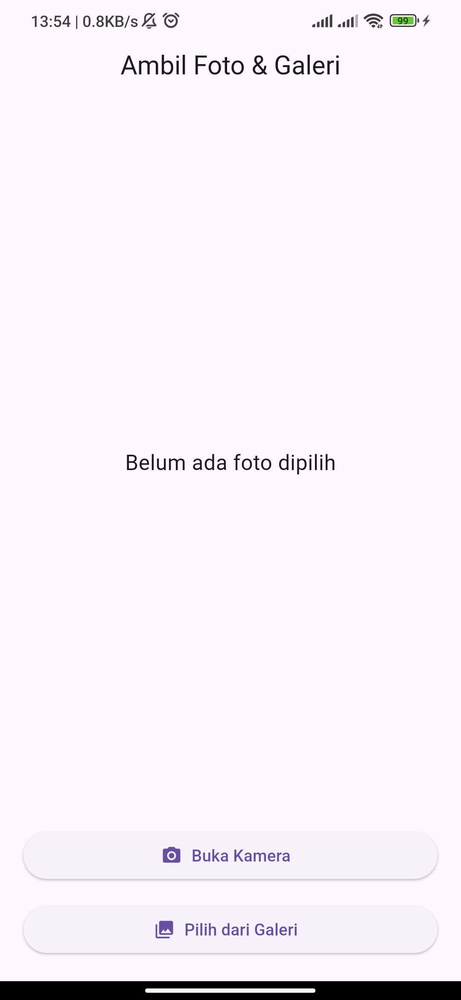
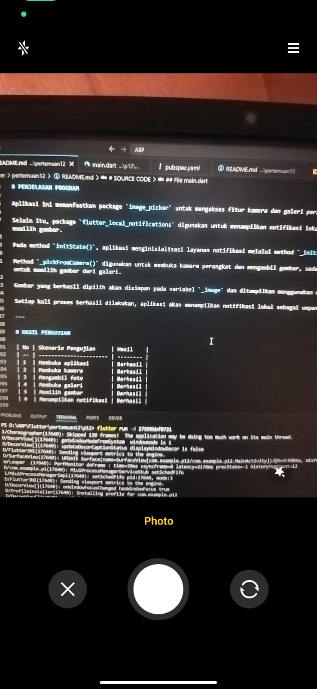
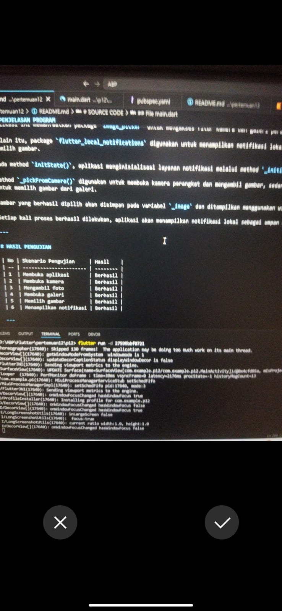
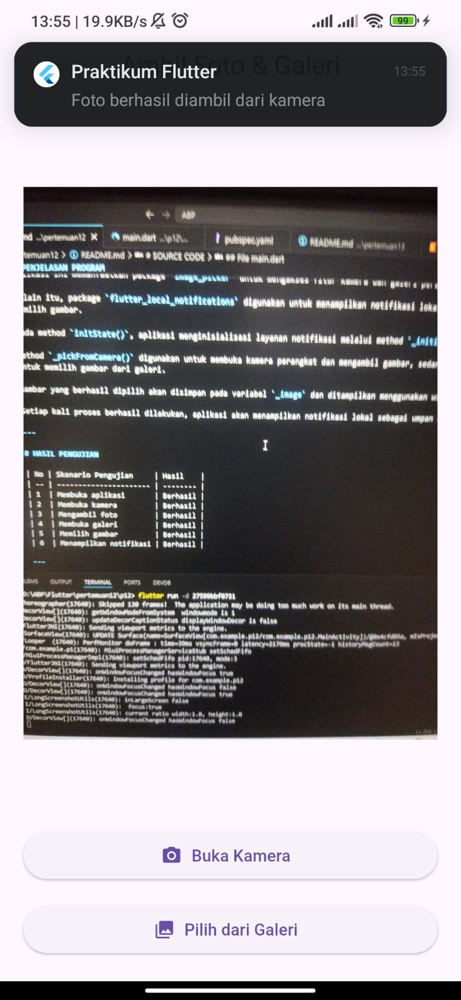
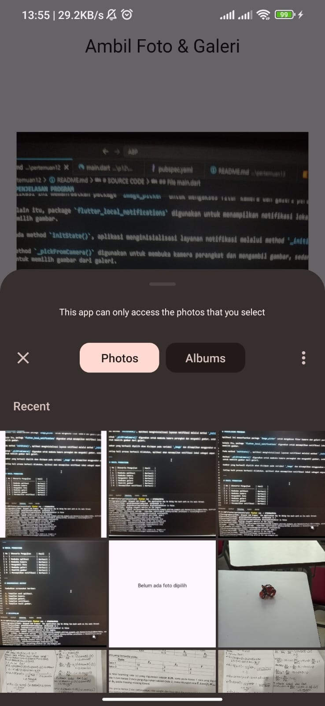

````md
# LAPORAN PRAKTIKUM

## APLIKASI BERBASIS PLATFORM

### PERTEMUAN 12 – INTEGRASI API PERANGKAT KERAS DAN NOTIFIKASI

---

**Disusun oleh:**

**Raka Andriy Shevchenko**  
**2311102054**

**Kelas IF-11-04**

**Dosen Pengampu:**  
Cahyo Prihantoro, S.Kom., M.Eng

**PROGRAM STUDI S1 TEKNIK INFORMATIKA**  
**FAKULTAS INFORMATIKA**  
**TELKOM UNIVERSITY PURWOKERTO**

**2025/2026**

---

## LINK REPOSITORY

Tambahkan link repository GitHub milik Anda di sini:

```text
https://github.com/shevaws/Aplikasi-Berbasis-Proyek
````

---

# TUJUAN PRAKTIKUM

Pada praktikum ini mahasiswa diharapkan mampu:

* Memahami penggunaan API perangkat keras pada Flutter.
* Mengakses kamera dan galeri perangkat menggunakan package `image_picker`.
* Mengimplementasikan notifikasi lokal menggunakan package `flutter_local_notifications`.
* Menampilkan gambar hasil pengambilan kamera atau galeri pada aplikasi.

---

# DASAR TEORI

## Image Picker

`image_picker` merupakan package Flutter yang digunakan untuk mengakses fitur kamera dan galeri pada perangkat mobile.

Package ini memungkinkan pengguna untuk mengambil gambar secara langsung menggunakan kamera atau memilih gambar yang telah tersimpan pada galeri perangkat.

## Flutter Local Notifications

`flutter_local_notifications` merupakan package Flutter yang digunakan untuk menampilkan notifikasi lokal pada perangkat Android maupun iOS.

Notifikasi lokal dapat digunakan untuk memberikan informasi kepada pengguna tanpa memerlukan koneksi internet atau layanan pihak ketiga.

## API Perangkat Keras

Flutter menyediakan berbagai package untuk mengakses fitur bawaan perangkat seperti:

* Kamera
* Galeri
* GPS
* Sensor
* Bluetooth
* Notifikasi

Integrasi API perangkat keras memungkinkan aplikasi memberikan pengalaman pengguna yang lebih interaktif.

---

# DEPENDENSI YANG DIGUNAKAN

Tambahkan package berikut pada file `pubspec.yaml`.

```yaml
dependencies:
  flutter:
    sdk: flutter

  image_picker: ^1.1.2
  flutter_local_notifications: ^17.2.3
```

Kemudian jalankan perintah berikut:

```bash
flutter pub get
```

---

# SOURCE CODE

## File `main.dart`

```dart
import 'dart:io';

import 'package:flutter/material.dart';
import 'package:image_picker/image_picker.dart';
import 'package:flutter_local_notifications/flutter_local_notifications.dart';

final FlutterLocalNotificationsPlugin flutterLocalNotificationsPlugin =
    FlutterLocalNotificationsPlugin();

void main() {
  runApp(const MyApp());
}

class MyApp extends StatelessWidget {
  const MyApp({super.key});

  @override
  Widget build(BuildContext context) {
    return MaterialApp(
      debugShowCheckedModeBanner: false,
      title: 'Notifikasi & API Perangkat Keras',
      theme: ThemeData(
        primarySwatch: Colors.blue,
      ),
      home: const HomePage(),
    );
  }
}

class HomePage extends StatefulWidget {
  const HomePage({super.key});

  @override
  State<HomePage> createState() => _HomePageState();
}

class _HomePageState extends State<HomePage> {
  File? _image;
  final ImagePicker _picker = ImagePicker();

  @override
  void initState() {
    super.initState();
    _initializeNotifications();
  }

  Future<void> _initializeNotifications() async {
    const AndroidInitializationSettings androidSettings =
        AndroidInitializationSettings('@mipmap/ic_launcher');

    const InitializationSettings settings =
        InitializationSettings(android: androidSettings);

    await flutterLocalNotificationsPlugin.initialize(settings);

    await flutterLocalNotificationsPlugin
        .resolvePlatformSpecificImplementation<
            AndroidFlutterLocalNotificationsPlugin>()
        ?.requestNotificationsPermission();
  }

  Future<void> _showNotification(String message) async {
    const AndroidNotificationDetails androidDetails =
        AndroidNotificationDetails(
      'photo_channel',
      'Photo Notifications',
      channelDescription:
          'Notifikasi saat foto berhasil dipilih atau diambil',
      importance: Importance.max,
      priority: Priority.high,
    );

    const NotificationDetails notificationDetails =
        NotificationDetails(android: androidDetails);

    await flutterLocalNotificationsPlugin.show(
      DateTime.now().millisecond,
      'Praktikum Flutter',
      message,
      notificationDetails,
    );
  }

  Future<void> _pickFromCamera() async {
    final XFile? photo =
        await _picker.pickImage(source: ImageSource.camera);

    if (photo != null) {
      setState(() {
        _image = File(photo.path);
      });

      await _showNotification(
        'Foto berhasil diambil dari kamera',
      );
    }
  }

  Future<void> _pickFromGallery() async {
    final XFile? photo =
        await _picker.pickImage(source: ImageSource.gallery);

    if (photo != null) {
      setState(() {
        _image = File(photo.path);
      });

      await _showNotification(
        'Foto berhasil dipilih dari galeri',
      );
    }
  }

  @override
  Widget build(BuildContext context) {
    return Scaffold(
      appBar: AppBar(
        title: const Text('Ambil Foto & Galeri'),
        centerTitle: true,
      ),
      body: Padding(
        padding: const EdgeInsets.all(20),
        child: Column(
          children: [
            Expanded(
              child: Center(
                child: _image == null
                    ? const Text(
                        'Belum ada foto dipilih',
                        style: TextStyle(fontSize: 18),
                      )
                    : Image.file(
                        _image!,
                        fit: BoxFit.contain,
                      ),
              ),
            ),

            const SizedBox(height: 20),

            SizedBox(
              width: double.infinity,
              child: ElevatedButton.icon(
                onPressed: _pickFromCamera,
                icon: const Icon(Icons.camera_alt),
                label: const Text('Buka Kamera'),
              ),
            ),

            const SizedBox(height: 15),

            SizedBox(
              width: double.infinity,
              child: ElevatedButton.icon(
                onPressed: _pickFromGallery,
                icon: const Icon(Icons.photo_library),
                label: const Text('Pilih dari Galeri'),
              ),
            ),
          ],
        ),
      ),
    );
  }
}
```

---

# PENJELASAN PROGRAM

Aplikasi ini memanfaatkan package `image_picker` untuk mengakses fitur kamera dan galeri perangkat.

Selain itu, package `flutter_local_notifications` digunakan untuk menampilkan notifikasi lokal ketika pengguna berhasil mengambil atau memilih gambar.

Pada method `initState()`, aplikasi menginisialisasi layanan notifikasi melalui method `_initializeNotifications()`.

Method `_pickFromCamera()` digunakan untuk membuka kamera perangkat dan mengambil gambar, sedangkan method `_pickFromGallery()` digunakan untuk memilih gambar dari galeri.

Gambar yang berhasil dipilih akan disimpan pada variabel `_image` dan ditampilkan menggunakan widget `Image.file()`.

Setiap kali proses berhasil dilakukan, aplikasi akan menampilkan notifikasi lokal sebagai umpan balik kepada pengguna.

---

# HASIL PENGUJIAN

| No | Skenario Pengujian     | Hasil    |
| -- | ---------------------- | -------- |
| 1  | Membuka aplikasi       | Berhasil |
| 2  | Membuka kamera         | Berhasil |
| 3  | Mengambil foto         | Berhasil |
| 4  | Membuka galeri         | Berhasil |
| 5  | Memilih gambar         | Berhasil |
| 6  | Menampilkan notifikasi | Berhasil |

---

# DOKUMENTASI OUTPUT

## 1. Tampilan Awal Aplikasi



## 2. Tampilan Kamera



## 3. Tampilan Galeri



## 4. Tampilan Notifikasi



## 5. Tampilan Hasil Gambar



---

# KESIMPULAN

Berdasarkan hasil praktikum, aplikasi berhasil mengintegrasikan API perangkat keras berupa kamera dan galeri menggunakan package `image_picker`.

Selain itu, notifikasi lokal berhasil diimplementasikan menggunakan package `flutter_local_notifications`.

Integrasi kedua fitur tersebut menunjukkan bahwa Flutter mampu memanfaatkan fitur bawaan perangkat untuk meningkatkan interaktivitas dan pengalaman pengguna.

```
```
