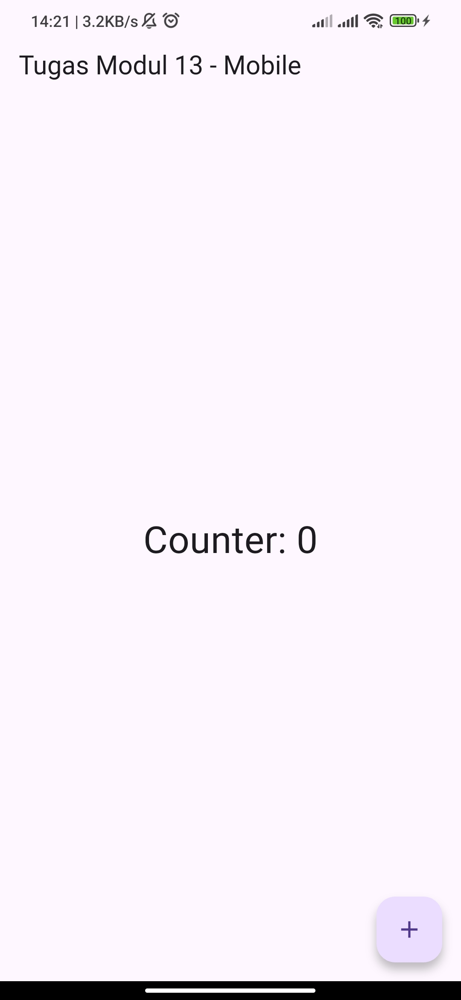
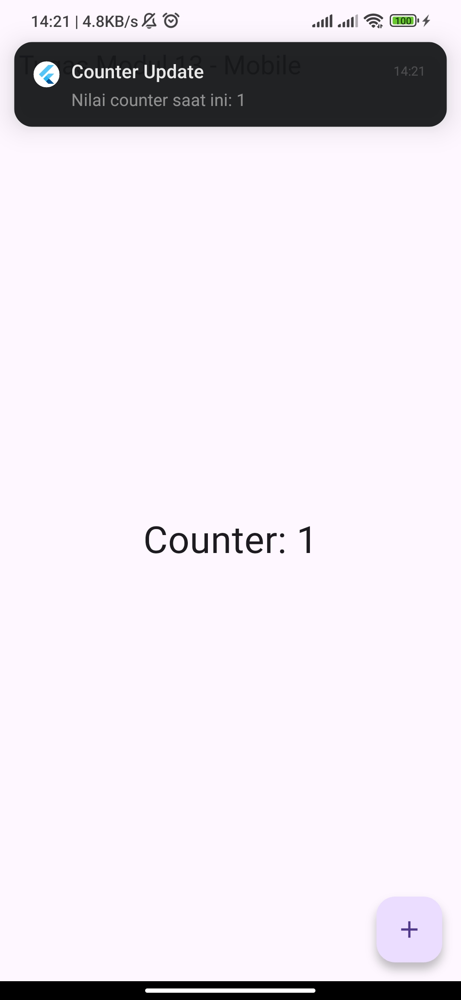

````md
# LAPORAN PRAKTIKUM

## APLIKASI BERBASIS PLATFORM

### PERTEMUAN 13 – STATE MANAGEMENT PROVIDER DAN NOTIFIKASI LOKAL

---

**Disusun oleh:**

**Raka Andriy Shevchenko**  
**2311102054**

**Kelas IF-11-04**

**Dosen Pengampu:**  
Cahyo Prihantoro, S.Kom., M.Eng

**PROGRAM STUDI S1 TEKNIK INFORMATIKA**  
**FAKULTAS INFORMATIKA**  
**TELKOM UNIVERSITY PURWOKERTO**

**2025/2026**

---

## LINK REPOSITORY

```text
https://github.com/shevaws/ABP
````

---

# TUJUAN PRAKTIKUM

Pada praktikum ini mahasiswa diharapkan mampu:

* Memahami konsep state management pada Flutter.
* Mengimplementasikan package `provider`.
* Mengelola perubahan data menggunakan `ChangeNotifier`.
* Mengintegrasikan notifikasi lokal pada aplikasi Flutter.
* Menampilkan pembaruan data secara real-time.

---

# DASAR TEORI

## State Management

State management merupakan teknik untuk mengelola data yang berubah selama aplikasi berjalan.

Dengan state management, data dapat dikelola secara terpusat sehingga mempermudah pemeliharaan dan pengembangan aplikasi.

## Provider

Provider adalah salah satu package state management yang populer pada Flutter.

Provider memanfaatkan `InheritedWidget` dan `ChangeNotifier` untuk mendistribusikan data ke seluruh widget secara efisien.

Keunggulan Provider antara lain:

* Mudah dipelajari.
* Ringan dan efisien.
* Memisahkan logika bisnis dari antarmuka pengguna.
* Mendukung pembaruan tampilan secara otomatis.

## Flutter Local Notifications

Package `flutter_local_notifications` digunakan untuk menampilkan notifikasi lokal pada perangkat.

Notifikasi akan muncul setiap kali nilai counter mengalami perubahan.

---

# DEPENDENSI YANG DIGUNAKAN

Tambahkan package berikut pada file `pubspec.yaml`.

```yaml
dependencies:
  flutter:
    sdk: flutter

  provider: ^6.1.2
  flutter_local_notifications: ^17.2.3
```

Kemudian jalankan perintah:

```bash
flutter pub get
```

---

# STRUKTUR PROJECT

```text
lib/
├── main.dart
├── counter_provider.dart
└── notification_service.dart
```

---

# SOURCE CODE

## File `counter_provider.dart`

```dart
import 'package:flutter/material.dart';
import 'notification_service.dart';

class CounterProvider with ChangeNotifier {
  int _counter = 0;

  int get counter => _counter;

  void increment() {
    _counter++;

    NotificationService.show(_counter);

    notifyListeners();
  }
}
```

## File `notification_service.dart`

```dart
import 'package:flutter_local_notifications/flutter_local_notifications.dart';

class NotificationService {
  static final FlutterLocalNotificationsPlugin _notifications =
      FlutterLocalNotificationsPlugin();

  static Future<void> init() async {
    const androidInit =
        AndroidInitializationSettings('@mipmap/ic_launcher');

    const settings = InitializationSettings(
      android: androidInit,
    );

    await _notifications.initialize(settings);
  }

  static Future<void> show(int counter) async {
    const androidDetails = AndroidNotificationDetails(
      'counter_channel',
      'Counter Notification',
      channelDescription: 'Notifikasi setiap counter bertambah',
      importance: Importance.max,
      priority: Priority.high,
    );

    const details = NotificationDetails(
      android: androidDetails,
    );

    await _notifications.show(
      0,
      'Counter Update',
      'Nilai counter saat ini: $counter',
      details,
    );
  }
}
```

## File `main.dart`

```dart
import 'package:flutter/material.dart';
import 'package:provider/provider.dart';

import 'counter_provider.dart';
import 'notification_service.dart';

void main() async {
  WidgetsFlutterBinding.ensureInitialized();

  await NotificationService.init();

  runApp(
    ChangeNotifierProvider(
      create: (_) => CounterProvider(),
      child: const MyApp(),
    ),
  );
}

class MyApp extends StatelessWidget {
  const MyApp({super.key});

  @override
  Widget build(BuildContext context) {
    return MaterialApp(
      debugShowCheckedModeBanner: false,
      home: const CounterPage(),
    );
  }
}

class CounterPage extends StatelessWidget {
  const CounterPage({super.key});

  @override
  Widget build(BuildContext context) {
    final counter = context.watch<CounterProvider>().counter;

    return Scaffold(
      appBar: AppBar(
        title: const Text('Tugas Modul 13 - Mobile'),
      ),
      body: Center(
        child: Text(
          'Counter: $counter',
          style: const TextStyle(fontSize: 32),
        ),
      ),
      floatingActionButton: FloatingActionButton(
        onPressed: () {
          context.read<CounterProvider>().increment();
        },
        child: const Icon(Icons.add),
      ),
    );
  }
}
```

---

# PENJELASAN PROGRAM

Aplikasi ini menerapkan state management menggunakan package `provider` untuk mengelola nilai counter.

Class `CounterProvider` mewarisi `ChangeNotifier` dan bertugas menyimpan serta memperbarui nilai counter.

Method `increment()` digunakan untuk menambah nilai counter, menampilkan notifikasi, dan memanggil `notifyListeners()` agar tampilan diperbarui secara otomatis.

Class `NotificationService` digunakan untuk menginisialisasi dan menampilkan notifikasi lokal.

Pada file `main.dart`, `ChangeNotifierProvider` digunakan untuk menyediakan objek `CounterProvider` ke seluruh widget dalam aplikasi.

Widget `context.watch()` digunakan untuk membaca nilai counter dan memperbarui tampilan ketika data berubah, sedangkan `context.read()` digunakan untuk memanggil method `increment()`.

---

# HASIL PENGUJIAN

| No | Skenario Pengujian           | Hasil    |
| -- | ---------------------------- | -------- |
| 1  | Membuka aplikasi             | Berhasil |
| 2  | Menampilkan nilai counter    | Berhasil |
| 3  | Menekan tombol tambah        | Berhasil |
| 4  | Counter bertambah            | Berhasil |
| 5  | Notifikasi muncul            | Berhasil |
| 6  | Tampilan diperbarui otomatis | Berhasil |

---

# DOKUMENTASI OUTPUT

## 1. Tampilan Awal Aplikasi



## 2. Menekan Tombol Tambah



## 3. Nilai Counter Bertambah


## 4. Tampilan Notifikasi


---

# KESIMPULAN

Berdasarkan hasil praktikum, package `provider` berhasil digunakan untuk mengelola state aplikasi.

Perubahan nilai counter dapat ditampilkan secara real-time tanpa perlu melakukan pembaruan manual pada antarmuka.

Selain itu, integrasi notifikasi lokal menggunakan package `flutter_local_notifications` berhasil memberikan informasi kepada pengguna setiap kali terjadi perubahan data.

Penerapan Provider membuat kode menjadi lebih terstruktur, mudah dipelihara, dan mudah dikembangkan pada aplikasi dengan skala yang lebih besar.

```
```
